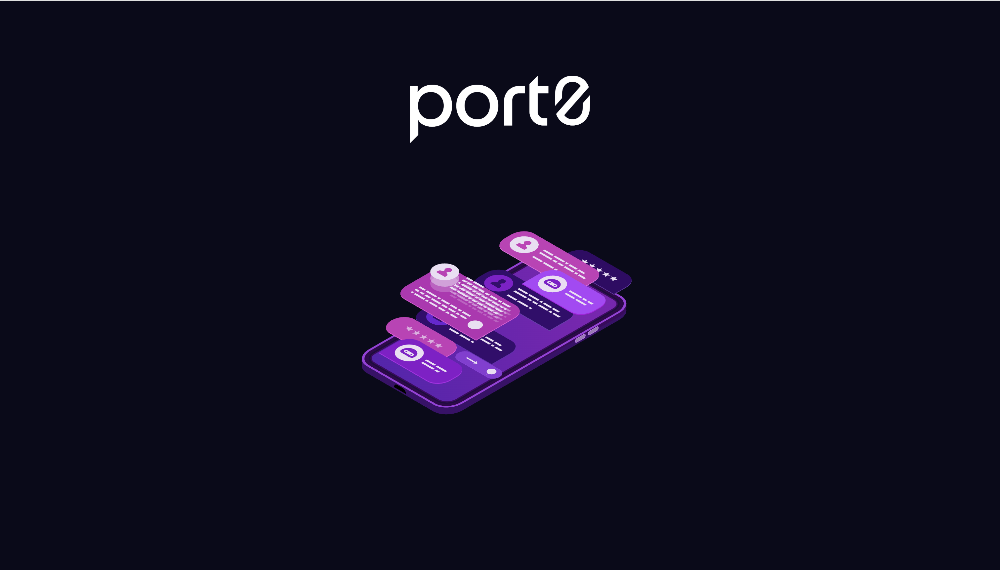
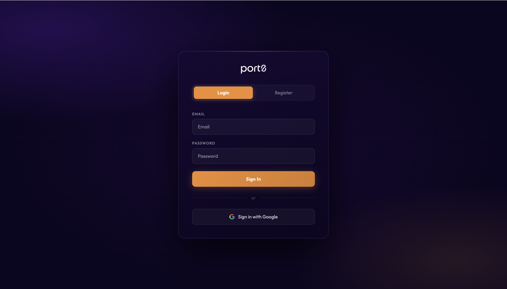
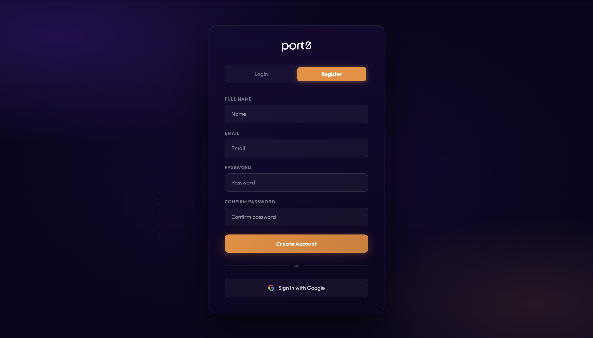
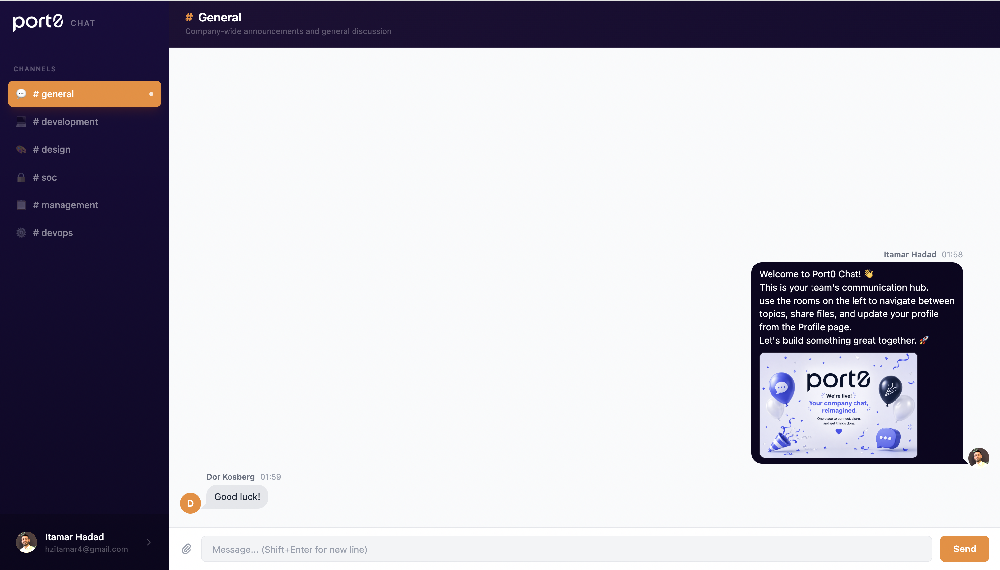
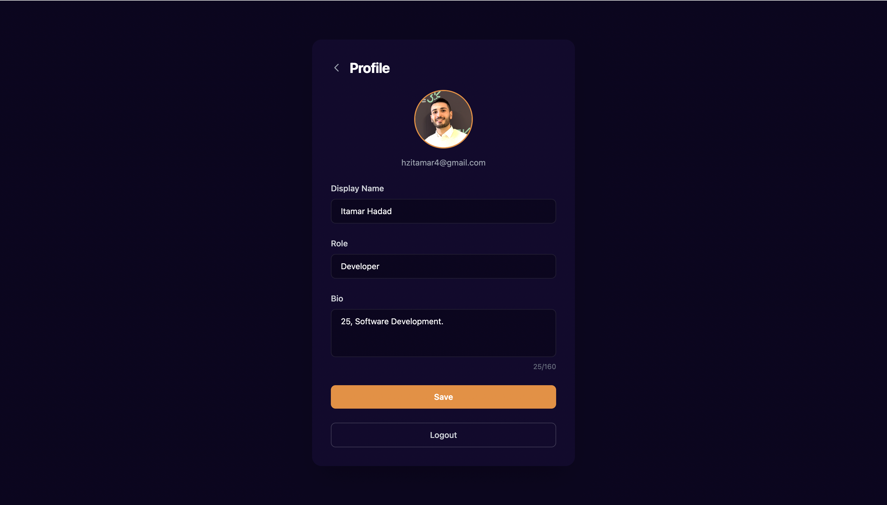

<p align="center">
  
</p>

<h1 align="center">Port0 Chat</h1>

<p align="center">
  <strong>Real time team communication, built on Firebase, styled for Port0.</strong>
</p>

<p align="center">
  
  
  
  
  
</p>

<p align="center">
  <a href="https://port0-chat.vercel.app">
    
  </a>
</p>

---

## Overview

Port0 Chat is a real time messaging app built with Firebase and React. It supports multiple chat rooms, file sharing, user profiles, and authentication — styled to match Port0's visual identity (deep purple dark theme, orange accents).

Built on the full Firebase ecosystem: **Firestore** for live data sync, **Authentication** for sign in, and **Storage** for file uploads, with a **React + Vite** frontend.

---

## ✨ Features

### 🔐 Authentication

- **Email & Password** registration with a live, 3 tier password strength indicator (length → letter → number)
- **Google Sign-In** one tap, zero friction
- Form-level validation with user friendly inline error messages
- Protected routes: unauthenticated users are automatically redirected to `/login`

---

### 💬 Real-Time Chat Rooms

Six dedicated channels out of the box: `#general`, `#development`, `#design`, `#soc`, `#management`, `#devops`

Messages are streamed live using **Firestore `onSnapshot`** — no polling, no page refreshes.

**Smart auto-scroll engine:**

- On initial room load → jumps instantly to the latest message
- On new incoming message → smooth-scrolls only if the user is already near the bottom
- If a user is reading history → stays exactly in place

---

### 📎 File Attachments

Send more than just text:

| Type                                                                  | Behavior                           |
| --------------------------------------------------------------------- | ---------------------------------- |
| Images (`jpg`, `png`, `gif`, `webp`, …)                               | Rendered inline in the chat bubble |
| Documents (`pdf`, `doc`, `docx`, `xls`, `xlsx`, `ppt`, `pptx`, `txt`) | Rendered as a titled download link |

- Max file size: **100 MB**
- Files are uploaded to **Firebase Storage** at `rooms/{roomId}/{timestamp}_{filename}`
- A live preview is shown in the input bar before sending
- Message document gains optional `fileURL`, `fileName`, and `fileType` fields

---

### 👤 User Profiles

- Edit display name and bio
- Upload a custom profile photo (stored in Firebase Storage)
- Changes sync in real time across all active sessions
- Consistent avatar display in chat messages

---

### 📱 Responsive Layout

- Mobile first sidebar with tap-to-open overlay
- Fixed viewport layout: only the message list scrolls — header, sidebar, and input bar stay anchored
- RTL aware message bubbles (`dir="auto"`) for Hebrew and Arabic text

---

## 🛠 Technology Stack

### Frontend

| Technology                | Role                                                         |
| ------------------------- | ------------------------------------------------------------ |
| **Vite + React 18**       | Build tooling & component model                              |
| **React Router v6**       | Client-side SPA routing (`/`, `/login`, `/chat`, `/profile`) |
| **Tailwind CSS v4**       | Utility-first styling via `@tailwindcss/vite` plugin         |
| **Outfit (Google Fonts)** | Typography                                                   |

### Firebase

| Service              | Usage                                                                                |
| -------------------- | ------------------------------------------------------------------------------------ |
| **Cloud Firestore**  | Real-time messages (`rooms/{roomId}/messages/`) and user profiles (`users/{userId}`) |
| **Firebase Auth**    | Email/password + Google Sign-In                                                      |
| **Firebase Storage** | Profile images and file attachments                                                  |

### Testing

| Tool                        | Role                                           |
| --------------------------- | ---------------------------------------------- |
| **Vitest**                  | Test runner (Vite-native, Jest-compatible API) |
| **Testing Library / React** | Component rendering & DOM queries              |
| **jsdom**                   | Browser environment simulation                 |

**60 / 60 tests passing** across 9 test suites.

---

## 🗂 Project Structure

```
port0-chat/
├── public/
├── src/
│   ├── assets/              # Port0 logo, SVGs
│   ├── contexts/
│   │   ├── AuthContext.jsx  # login, register, googleSignIn, logout
│   │   └── ChatContext.jsx  # selectedRoom state
│   ├── components/
│   │   ├── Sidebar.jsx      # Room list, logo, active-room pill
│   │   ├── ChatRoom.jsx     # Header + MessageList + MessageInput
│   │   ├── MessageList.jsx  # Firestore subscription, auto-scroll
│   │   ├── MessageItem.jsx  # Bubble layout + FileAttachment
│   │   ├── MessageInput.jsx # Text input + file picker + send
│   │   └── ProtectedRoute.jsx
│   ├── pages/
│   │   ├── SplashPage.jsx   # Animated SVG intro
│   │   ├── LoginPage.jsx    # Login / Register tabs + password strength
│   │   ├── ChatPage.jsx     # Sidebar + ChatRoom layout
│   │   └── ProfilePage.jsx  # Avatar upload, name & bio editor
│   ├── firebase.js          # initializeApp → auth, db, storage
│   ├── App.jsx              # BrowserRouter + providers + routes
│   └── index.css            # Outfit import + @import "tailwindcss"
├── tests/                   # Vitest suites (gitignored)
├── .env                     # Firebase config keys (gitignored)
├── index.html
├── vite.config.js
└── package.json
```

---

## 🏗 Architecture

```
┌─────────────────────────────────────────┐
│              React SPA (Vite)           │
│                                         │
│  AuthContext ──────────────────────┐    │
│  (Firebase Auth)                   │    │
│                                    ▼    │
│  ChatContext     SplashPage   LoginPage │
│  (room state)         │            │    │
│       │               └────────────┘    │
│       ▼                                 │
│  ChatPage                               │
│  ├── Sidebar (room selection)           │
│  └── ChatRoom                           │
│       ├── MessageList ◄── onSnapshot ─┐ │
│       └── MessageInput ──────────────┘ │
│                │                        │
│           Firebase Storage              │
└─────────────────────────────────────────┘
           │              │
     Firestore       Firebase Auth
  (messages, users)  (email / Google)
```

**State model:** Two React contexts only: `AuthContext` for identity, `ChatContext` for selected room.

**Security:** Firestore rules enforce `request.auth != null` on all reads and writes — unauthenticated access is blocked at the database level.

---

## 🚀 Getting Started

### Prerequisites

- Node.js ≥ 18
- A Firebase project with Firestore, Authentication, and Storage enabled

### 1. Clone & install

```bash
git clone https://github.com/YOUR_USERNAME/port0-chat.git
cd port0-chat
npm install
```

### 2. Configure Firebase

Create a `.env` file in the project root:

```env
VITE_FIREBASE_API_KEY=...
VITE_FIREBASE_AUTH_DOMAIN=...
VITE_FIREBASE_PROJECT_ID=...
VITE_FIREBASE_STORAGE_BUCKET=...
VITE_FIREBASE_MESSAGING_SENDER_ID=...
VITE_FIREBASE_APP_ID=...
```

### 3. Enable Firebase services

In the Firebase console:

- **Authentication** → enable Email/Password and Google providers
- **Firestore** → create database, set rules to `allow read, write: if request.auth != null`
- **Storage** → enable with default rules

### 4. Run locally

```bash
npm run dev
```

### 5. Run tests

```bash
npx vitest run
```

---

## 📸 Screenshots

### Splash & Authentication

<p align="center">
  
  
  
</p>
<p align="center">
  <sub>Splash Screen</sub> &nbsp;•&nbsp; <sub>Login</sub> &nbsp;•&nbsp; <sub>Register with Password Strength</sub>
</p>

---

### Chat Experience

<p align="center">
  
</p>
<p align="center">
  <sub>Real-Time Chat Room</sub> &nbsp;•&nbsp; <sub>Room Sidebar</sub>
</p>

---

### User Profile

<p align="center">
  
</p>
<p align="center">
  <sub>Profile Editor</sub>
</p>

---

## 🔮 Potential Enhancements

- Push notifications for new messages (Firebase Cloud Messaging)
- Message reactions and threads
- User presence indicators (online / offline)
- Message search and history pagination
- Direct messages between users

---

## 👤 Author

**Itamar Hadad**

📧 [hzitamar4@gmail.com](mailto:hzitamar4@gmail.com)  
🔗 [linkedin.com/in/itamar-hadad](https://www.linkedin.com/in/itamar-hadad-1aa946307/)

---

<p align="center">
  Styled to match <a href="https://port0.io">port0.io</a>
</p>
